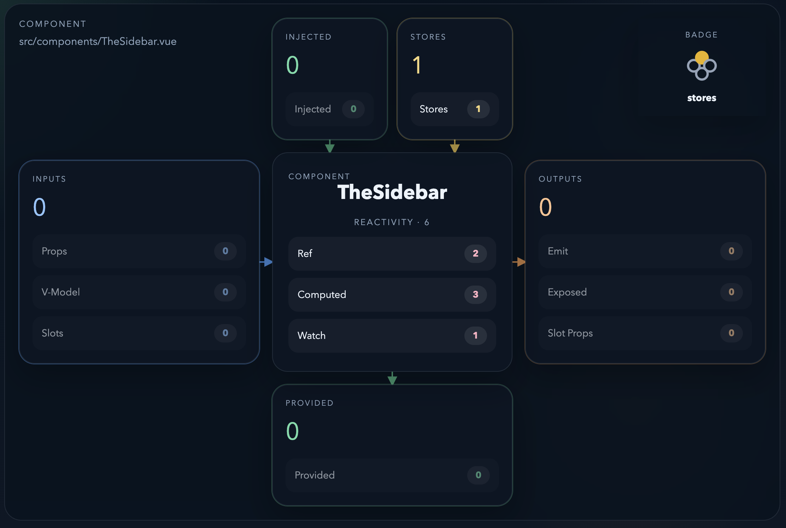
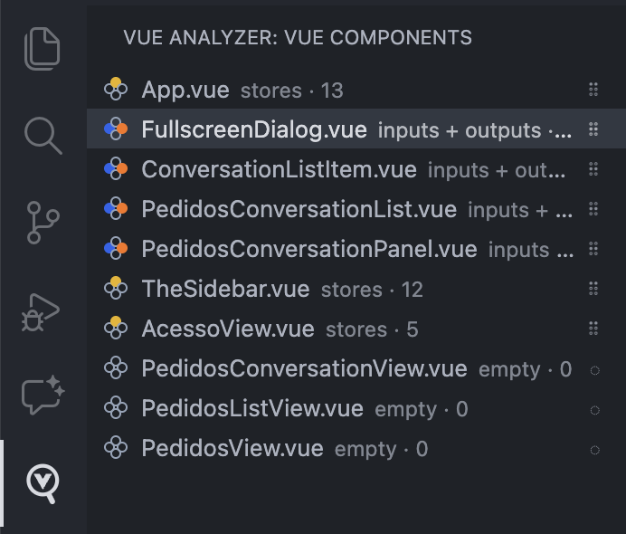
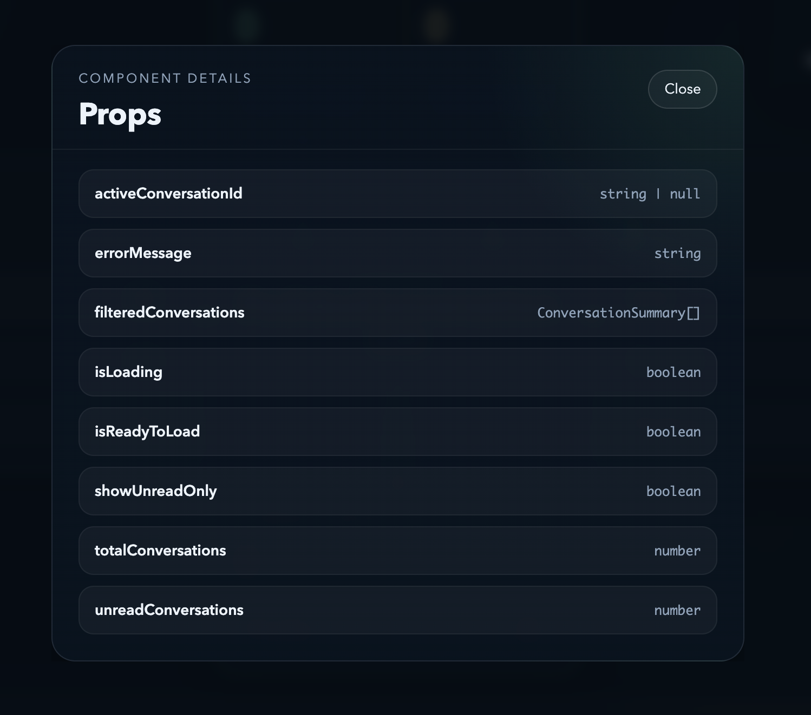

# Vue Component Analyzer

VS Code extension for inspecting the external contract and complexity profile of Vue 3 single-file components.



## Features

- Editor title action for `.vue` files
- Analysis webview with grouped signals and badge classification
- Sidebar tree view under `Vue Analyzer`
- File badges for common component profiles
- Detail dialogs for props, slots, emits, stores, injects, provides, exposed members, slot props, refs, computed values, and watchers
- Cached analysis refreshed on open, save, and file watcher events

## Signals

- Inputs: props, `v-model`, slots
- Injected dependencies: inject usage
- Stores: detected store references
- Reactivity: refs, computed values, and watcher usage
- Outputs: emits, exposed members, slot props
- Provides: provided dependencies
- Score: total complexity per file
- Badge: summarized component profile

Current parsing covers `<script setup>`, `<script>`, and `<template>` signals in Vue 3 SFCs.

## Views

### 1. See the component profile

Run `Vue Analyzer: Show Complexity` from the editor title action.


### 2. Scan the whole workspace

Browse analyzed `.vue` files in the `Vue Analyzer` activity bar view.



### 3. Drill into exact details

Open category dialogs from the webview for exact contract items.



## Workflow

1. Open a `.vue` file.
2. Click the editor title badge or run `Vue Analyzer: Show Complexity`.
3. Review the visual analysis panel.
4. Open the `Vue Analyzer` sidebar to compare other components.
5. Click a metric to inspect the exact items detected in that category, including internal reactivity signals.

## Limitations

- Configurable scoring weights are not implemented yet.
- Classic `setup()` and full Options API coverage are not complete yet.

## Output

Versioned JSON result:

```json
{
  "component": {
    "name": "UserProfileCard",
    "path": "src/components/UserProfileCard.vue"
  },
  "external": {
    "props": [],
    "emits": [],
    "slots": [],
    "models": [],
    "injects": [],
    "stores": [],
    "apiCalls": [],
    "exposed": []
  },
  "internal": {
    "refs": [],
    "computed": [],
    "watchers": [],
    "methods": []
  },
  "scores": {
    "external": 0,
    "internal": 0,
    "total": 0
  },
  "meta": {
    "warnings": [],
    "version": 1
  }
}
```

## Development

```sh
npm install
npm run build
```

Then launch the extension in development mode:

1. Open this folder in VS Code.
2. Press `F5`.
3. In the Extension Development Host, open a `.vue` file.
4. Click the analyzer action in the editor title.

Quick manual test: `samples/UserProfileCard.vue`.

## Scripts

- `npm run build`: bundle the extension into `dist/extension.js`
- `npm run watch`: rebuild automatically while editing
- `npm run package`: create a `.vsix` package

## Project structure

```text
vue-component-analyzer/
  media/
  samples/
    UserProfileCard.vue
  src/
    analyzer/
      index.ts
      vueSfcAnalyzer.ts
    extension/
      analysisCache.ts
      componentAnalysisTreeProvider.ts
      fileDecorationProvider.ts
    types/
      analysis.ts
    webview/
      renderComplexityWebview.ts
    extension.ts
  package.json
  tsconfig.json
  README.md
```

## Architecture

- `src/analyzer`: Vue analysis logic independent from VS Code APIs
- `src/types`: versioned analysis contracts and shared type definitions
- `src/extension`: VS Code integration such as cache, tree view, and decorations
- `src/webview`: rendering logic for the analysis experience
- `src/extension.ts`: extension activation, commands, watchers, and UI wiring

## Roadmap

1. Expand support for classic `setup()` and Options API patterns.
2. Separate extraction and scoring into clearer modules.
3. Add configurable scoring weights.
4. Broaden store and API call detection rules.
5. Add automated analyzer coverage for macros and template patterns.