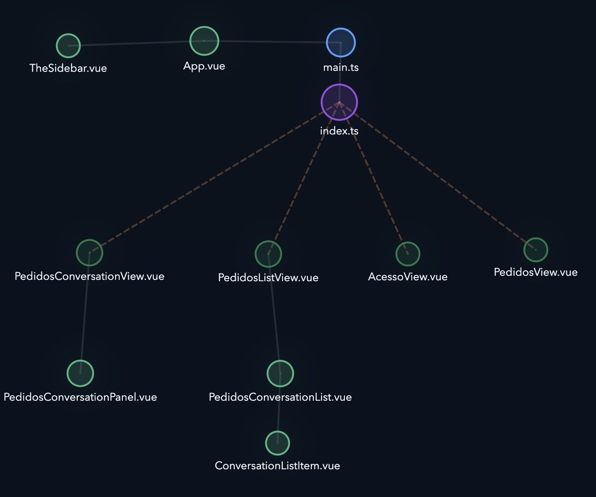
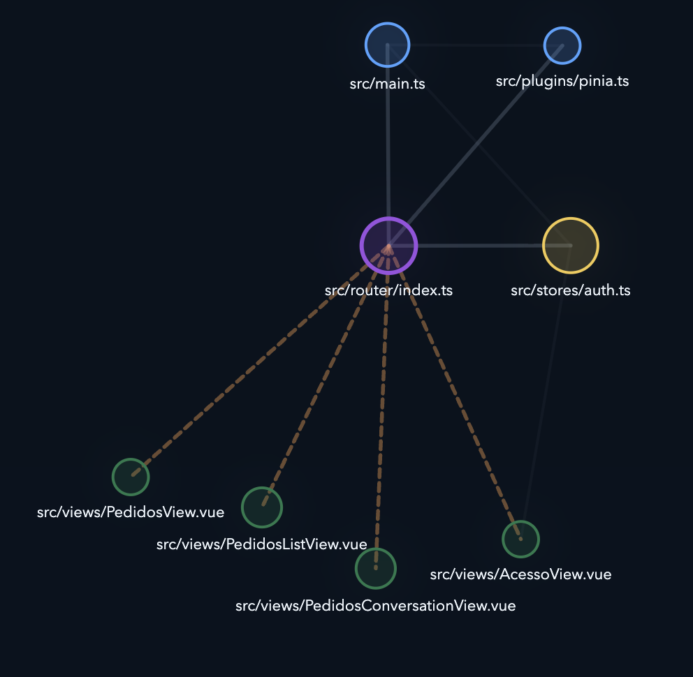

# Vue Project and Components Analyzer

VS Code extension to have project overview and inspecting the external contract and complexity profile of Vue 3 single-file components.


|Project Overview|Component Overview|
|-----|-----|
|||


### Component Complexity Analyzer


## Features

- Editor title action for `.vue` files
- Analysis webview with grouped signals, reactivity details, and badge classification
- Interactive project graph webview for Vue and TypeScript file relations with filters, zoom, and node selection
- Sidebar tree view under `Vue Analyzer` with list and folder modes, and per-metric sorting
- Project Graph sidebar panel with a quick-launch button to open the full graph
- File badges for common component profiles
- Detail dialogs for props, slots, emits, stores, injects, provides, exposed members, slot props, refs, computed values, and watchers
- Cached analysis refreshed on open, save, and `.vue`/`.ts` file watcher events

## Signals

- Inputs: props, `v-model`, slots
- Injected dependencies: inject usage
- Stores: detected store references
- Reactivity: refs, computed values, and watcher usage
- Outputs: emits, exposed members, slot props
- Provides: provided dependencies
- Score: total complexity per file
- Badge: summarized component profile

Current parsing covers `<script setup>`, `<script>`, and `<template>` signals in Vue 3 SFCs.

## Views

### 1. See the component profile

Run `Vue Analyzer: Show Complexity` from the editor title action.


### 2. Scan the whole workspace

Browse analyzed `.vue` files in the `Vue Analyzer` activity bar view.

The `Vue Components` tree can be shown in two modes:

- `List`: flat list across the workspace
- `Folders`: default mode, mirrors the workspace directory structure, and opens folders expanded

When `List` mode is active, you can sort the sidebar by:

- path
- inputs
- reactivity
- outputs
- injected dependencies
- provided dependencies
- stores

Use the toggle buttons in the sidebar title bar to switch modes and change the sort. Both settings are persisted via workspace configuration:

- `vueComponentAnalyzer.components.viewMode` — `list` or `folders` (default: `folders`)
- `vueComponentAnalyzer.components.listSortBy` — sort key for list mode (default: `path`)


### 3. Visualize file relations

Run `Vue Analyzer: Show Project Graph` from the command palette or the sidebar title actions.

The graph renders workspace `.vue` and `.ts` files as nodes and draws edges for detected relative `import`, `export ... from`, `import()`, and `require()` relations.

#### Filter controls

The graph panel has two filter sections:

**Graph**
- Hide isolated files — removes files with no edges
- Show labels — toggle filename labels on nodes
- Show test files — include `__tests__`, `.spec.ts`, `.spec.js`
- Show Histoire and Storybook files — include `.stories.*`, `.story.*`

**Architecture**
- Show app entry files (`src/App.vue`, `src/main.ts`)
- Show router
- Show services
- Show stores
- Show composable TS files
- Show view components (files under `views/*/components/`)

A **Component Folders** section appears automatically when `src/components/` has subfolders, with one toggle per subfolder. Each section has **All / None** quick toggles.

#### Graph interactions

- **Pan**: drag the canvas background
- **Zoom**: use the `+` / `Reset` / `-` overlay buttons, or scroll
- **Hover**: hovering a node highlights it and its direct neighbors, dims all others, and shows the full relative path instead of just the filename
- **Select**: click a node to focus the graph on it — only the node and its immediate import/export neighbors are shown, arranged in an orbital layout; a badge at the top-left shows the file path with a deselect (✕) button
- **Open file**: click an already-selected node a second time to open it in the editor
- **Drag nodes**: drag any node to reposition it manually

#### Legend

| Swatch | Meaning |
|--------|---------|
| Green (Vue) | `.vue` file |
| Blue | TypeScript file |
| Green (Component) | `components/` folder |
| Dark green | `views/` folder |
| Purple | `router/` folder |
| Yellow | `stores/` folder |
| Orange | `services/` folder |
| Solid line | Static `import` / `export … from` |
| Dashed line | Dynamic `import()` / `require()` |

The graph auto-refreshes whenever `.vue` or `.ts` files are saved, created, renamed, or deleted.

### 4. See reactivity signals inside the component

The component diagram now shows ref, computed, and watcher counts directly inside the component node. Click any reactivity metric to open a detail dialog listing the exact signal names. Watcher entries include the watched source expression (e.g. `myRef`, `[a, b]`, `getter`).

### 5. Drill into exact details

Open category dialogs from the webview for exact contract items.


## Workflow

1. Open a `.vue` file.
2. Click the editor title badge or run `Vue Analyzer: Show Complexity`.
3. Review the visual analysis panel, including the reactivity signals shown inside the component node.
4. Run `Vue Analyzer: Show Project Graph` to inspect file-level relations across the workspace.
5. Open the `Vue Analyzer` sidebar to compare other components.
6. Switch the sidebar between `List` and `Folders` mode using the title bar icons; in `List` mode, use the sort button to order by any metric.
7. Click a metric to inspect the exact items detected in that category, including internal reactivity signals.

## Limitations

- Configurable scoring weights are not implemented yet.
- Classic `setup()` and full Options API coverage are not complete yet.

## Output

Versioned JSON result:

```json
{
  "component": {
    "name": "UserProfileCard",
    "path": "src/components/UserProfileCard.vue"
  },
  "external": {
    "props": [],
    "emits": [],
    "slots": [],
    "models": [],
    "injects": [],
    "stores": [],
    "apiCalls": [],
    "exposed": []
  },
  "internal": {
    "refs": [],
    "computed": [],
    "watchers": [],
    "methods": []
  },
  "scores": {
    "external": 0,
    "internal": 0,
    "total": 0
  },
  "meta": {
    "warnings": [],
    "version": 1
  }
}
```

## Development

```sh
npm install
npm run build
```

Then launch the extension in development mode:

1. Open this folder in VS Code.
2. Press `F5`.
3. In the Extension Development Host, open a `.vue` file.
4. Click the analyzer action in the editor title.

Quick manual test: `samples/UserProfileCard.vue`.

## Scripts

- `npm run build`: bundle the extension into `dist/extension.js`
- `npm run watch`: rebuild automatically while editing
- `npm run package`: create a `.vsix` package

## Project structure

```text
vue-component-analyzer/
  media/
    webview/
      graph.css
      graph.html
      graph.js
      index.html
      main.js
      style.css
  samples/
    UserProfileCard.vue
  src/
    analyzer/
      index.ts
      vueSfcAnalyzer.ts
    extension/
      analysisCache.ts
      componentAnalysisTreeProvider.ts
      fileDecorationProvider.ts
      projectGraphService.ts
    types/
      analysis.ts
      projectGraph.ts
    webview/
      renderComplexityWebview.ts
      renderProjectGraphWebview.ts
    extension.ts
  package.json
  tsconfig.json
  README.md
```

## Architecture

- `src/analyzer`: Vue analysis logic independent from VS Code APIs
- `src/types`: versioned analysis contracts and shared type definitions, including the project graph model
- `src/extension`: VS Code integration such as cache, tree view, decorations, and project graph discovery
- `src/webview`: rendering logic for the analysis experience and the project graph webview
- `src/extension.ts`: extension activation, commands, watchers, and UI wiring

## Roadmap

1. Expand support for classic `setup()` and Options API patterns.
2. Separate extraction and scoring into clearer modules.
3. Add configurable scoring weights.
4. Broaden store and API call detection rules.
5. Add automated analyzer coverage for macros and template patterns.